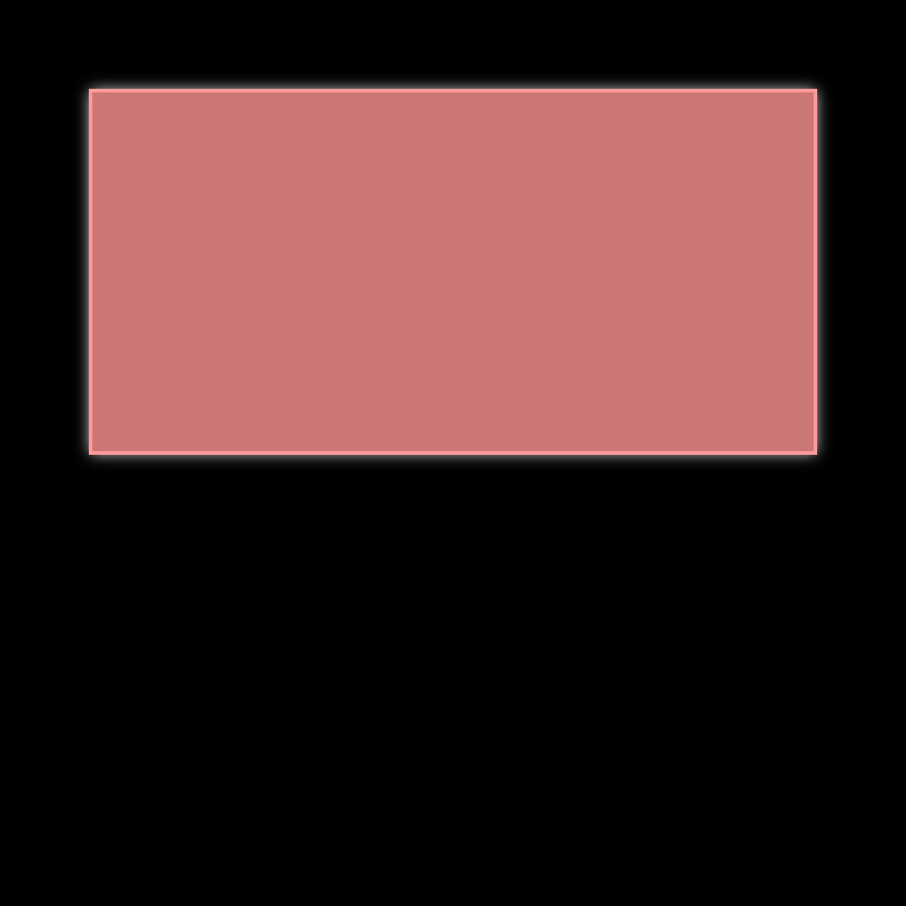
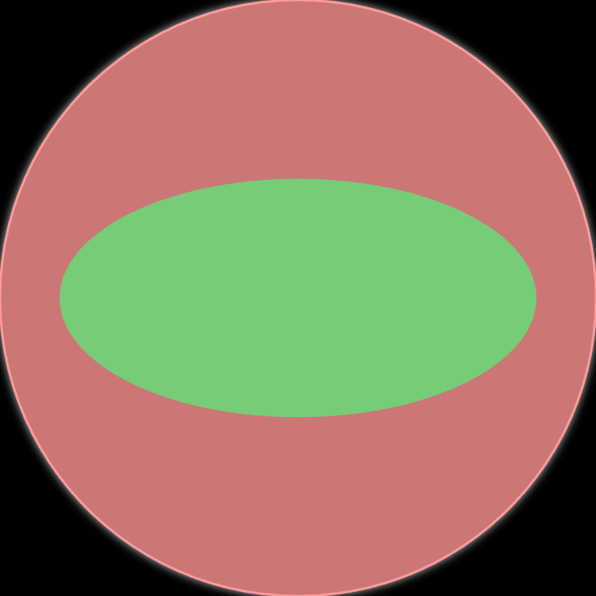
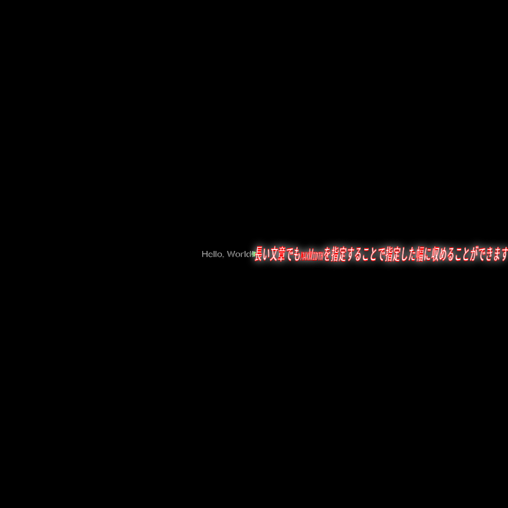
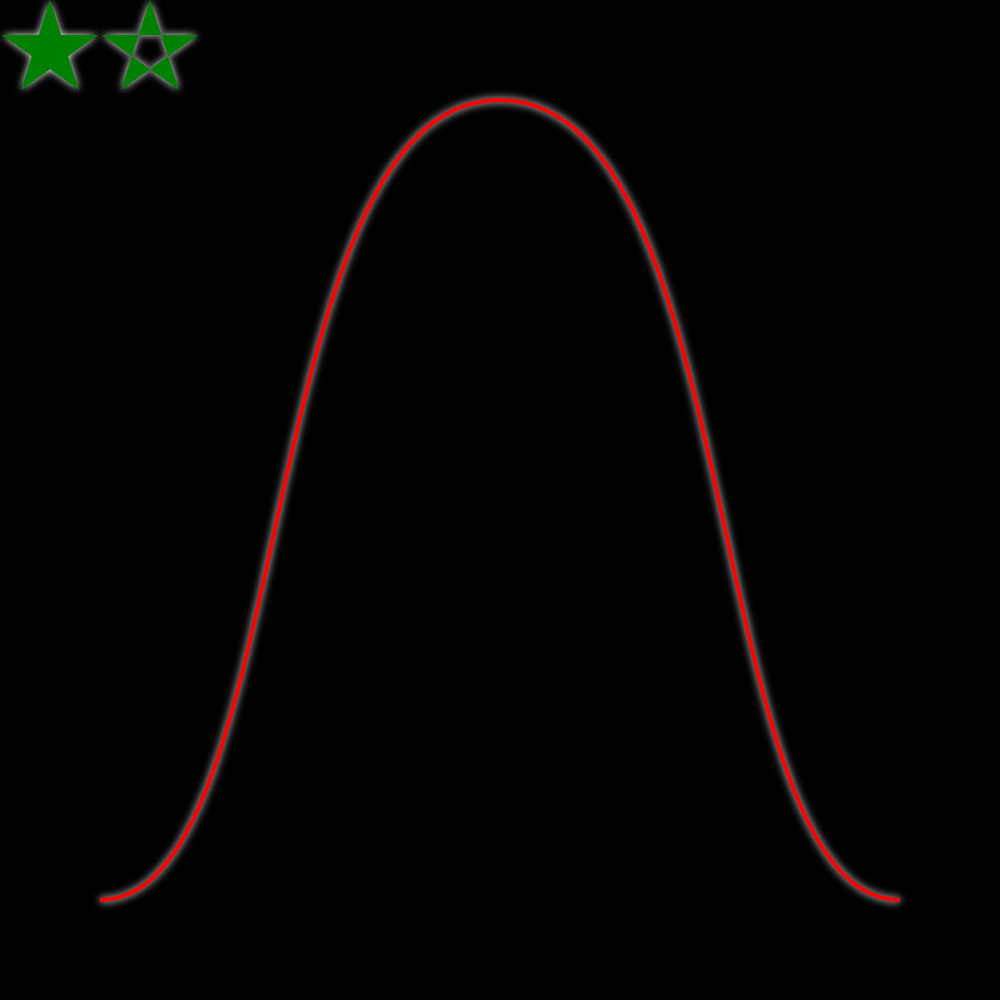

# `CanvasRenderingContext2D.prototype.axt_draw()`

> - First Appearance : `ver0.2.0`
> - Latest Update : `ver0.2.0`

- Canvasのための汎用描画メソッドです。
- `OffscreenCanvasRenderingContext2D.prototype.axt_draw()`も同様に機能します。
- 以下の図形のうち、第1引数で指定したものを描画します。
    - 長方形(矩形) `rectangle`
    - 楕円 `ellipse`
    - テキスト `text`
    - SVGパスコマンド `path`
- 図形の描画とは別に、影をどのように描画するかも設定できます。

## 引数

`axt_draw()`は、2つの引数をとります。

```js
/**
 * @param {String} kind - 描画する図形の種類 (許可値 : `"rectangle"`(矩形), `"ellipse"`(楕円), `"text"`(テキスト), `"path"`(パス))
 * @param {Object} options - 描画時のオプション
 */
```

どの図形を描画するかによって、`options`に必要なプロパティが変わります。

## 影の描画設定

どの図形を描画するかに関わらず、`options.shadowFill`, `options.shadowStroke`を指定することで影の描画設定を変更することができます。  
`axt_draw()`は、`options.shadowFill`, `options.shadowStroke`のプロパティにnullishでない値が指定されている場合に、一時的に描画する図形の影の描画に関する設定を変更します。  
`options.shadowFill`, `options.shadowStroke`は配列で、先頭の要素から順に、`ctx.shadowOffsetX`, `ctx.shadowOffsetY`, `ctx.shadowBlur`, `ctx.shadowColor`に対応します。  
以下は、有効な`options.shadowFill`, `options,shadowStroke`の例です。
```js
[0, 2, 4, "black"]
```

```js
/**
 * 【影の描画設定に関連する引数】
 *      @param {(Number|String)[]} [options.shadowFill] - 塗りつぶし部分に対する影の描画に関する設定。[右方向ずらし量(px), 下方向ずらし量(px), ぼかし量(px), 影の色(String)]の順で指定する。省略した場合は影を描画しない。
 *      @param {(Number|String)[]} [options.shadowStroke] - 輪郭部分に対する影の描画に関する設定。[右方向ずらし量(px), 下方向ずらし量(px), ぼかし量(px), 影の色(String)]の順で指定する。省略した場合は影を描画しない。
 */
```

## 長方形(矩形)

長方形(矩形)を描画する場合、`options`の以下のプロパティの指定が有効です。

```js
/**
 * 【長方形(矩形)の描画で有効な引数】
 *      @param {String} kind - 描画する図形の種類 (許可値 : `"rectangle"`(矩形), `"ellipse"`(楕円), `"text"`(テキスト), `"path"`(パス))
 *      @param {Object} options - 描画時のオプション
 *      @param {String|CanvasGradient|CanvasPattern} options.fill - 塗りつぶし色(塗りつぶさない場合はnullishを指定)
 *      @param {String|CanvasGradient|CanvasPattern} options.stroke - 輪郭色(塗りつぶさない場合はnullishを指定)
 *      @param {Object} [options.shadow] - 影の描画に関する設定
 *      @param {(Number|String)[]} [options.shadowFill] - 塗りつぶし部分に対する影の描画に関する設定。[右方向ずらし量(px), 下方向ずらし量(px), ぼかし量(px), 影の色(String)]の順で指定する。省略した場合は影を描画しない。
 *      @param {(Number|String)[]} [options.shadowStroke] - 輪郭部分に対する影の描画に関する設定。[右方向ずらし量(px), 下方向ずらし量(px), ぼかし量(px), 影の色(String)]の順で指定する。省略した場合は影を描画しない。
 *      @param {Array} options.corner - 角をどのように描画するか
 *      @param {"C"|"R"} [options.corner[0] = "C"] - 角の描画タイプ。Cで角落とし、Rで角丸
 *      @param {Number} [options.corner[1] = 0] - 角の半径(px)。矩形の短辺の半分を超える値は無効
 *      @param {Number[]} options.size - 図形の描画幅・高さ(px)。[幅, 高さ]の順で指定する
 *      @param {Number[]} options.pos - [基準点のZ座標, 基準点のY座標]
 *      @param {String} [options.align = ""] - 整列方向の一括設定 (許可値 : `""`, `"n"`, `"ne"`, `"e"`, `"se"`, `"s"`, `"sw"`, `"w"`, `"nw"`)
 *  ※以下、`options.stroke`が`"none"`でない場合のみ有効
 *      @param {Number} [options.thickness = 1] - 輪郭の太さ(px)
 */
```

### 例

```js
canvas.ctx.axt_draw("rectangle", {
    "fill": "black",
    "size": [1000, 1000],
    "pos": [500, 1000],
    "align": "s"
});
canvas.ctx.axt_draw("rectangle", {
    "fill": "#c77",
    "stroke": "#f99",
    "shadowFill": [0, 0, 16, "#eee"],
    "size": [800, 400],
    "pos": [100, 100],
    "align": "nw",
    "thickness": 4
});
```



## 楕円

楕円を描画する場合、`options`の以下のプロパティの指定が有効です。

```js
/**
 * 【楕円の描画で有効な引数】
 *      @param {String} kind - 描画する図形の種類 (許可値 : `"rectangle"`(矩形), `"ellipse"`(楕円), `"text"`(テキスト), `"path"`(パス))
 *      @param {Object} options - 描画時のオプション
 *      @param {String|CanvasGradient|CanvasPattern} options.fill - 塗りつぶし色(塗りつぶさない場合はnullishを指定)
 *      @param {String|CanvasGradient|CanvasPattern} options.stroke - 輪郭色(塗りつぶさない場合はnullishを指定)
 *      @param {Object} [options.shadow] - 影の描画に関する設定
 *      @param {(Number|String)[]} [options.shadowFill] - 塗りつぶし部分に対する影の描画に関する設定。[右方向ずらし量(px), 下方向ずらし量(px), ぼかし量(px), 影の色(String)]の順で指定する。省略した場合は影を描画しない。
 *      @param {(Number|String)[]} [options.shadowStroke] - 輪郭部分に対する影の描画に関する設定。[右方向ずらし量(px), 下方向ずらし量(px), ぼかし量(px), 影の色(String)]の順で指定する。省略した場合は影を描画しない。
 *      @param {Number[]} options.size - 図形の描画幅・高さ(px)。[幅, 高さ]の順で指定する
 *      @param {Number[]} options.pos - [基準点のZ座標, 基準点のY座標]
 *      @param {String} [options.align = ""] - 整列方向の一括設定 (許可値 : `""`, `"n"`, `"ne"`, `"e"`, `"se"`, `"s"`, `"sw"`, `"w"`, `"nw"`)
 *  ※以下、`options.stroke`が`"none"`でない場合のみ有効
 *      @param {Number} [options.thickness = 1] - 輪郭の太さ(px)
 */
```

### 例

```js
canvas.ctx.axt_draw("rectangle", {
    "fill": "black",
    "size": [1000, 1000],
    "pos": [500, 1000],
    "align": "s"
});
canvas.ctx.axt_draw("ellipse", {
    "fill": "#c77",
    "stroke": "#f99",
    "shadowFill": [0, 0, 16, "#eee"],
    "size": [1000, 1000],
    "pos": [500, 500],
    "align": "",
    "thickness": 4
});
canvas.ctx.axt_draw("ellipse", {
    "fill": "#7c7",
    "stroke": null,
    "size": [800, 400],
    "pos": [900, 700],
    "align": "se",
    "thickness": 4
});
```



## テキスト

テキストを描画する場合、`options`の以下のプロパティの指定が有効です。

```js
/**
 * 【テキストの描画で有効な引数】
 *      @param {String} kind - 描画する図形の種類 (許可値 : `"rectangle"`(矩形), `"ellipse"`(楕円), `"text"`(テキスト), `"path"`(パス))
 *      @param {Object} options - 描画時のオプション
 *      @param {String|CanvasGradient|CanvasPattern} options.fill - 塗りつぶし色(塗りつぶさない場合はnullishを指定)
 *      @param {String|CanvasGradient|CanvasPattern} options.stroke - 輪郭色(塗りつぶさない場合はnullishを指定)
 *      @param {Object} [options.shadow] - 影の描画に関する設定
 *      @param {(Number|String)[]} [options.shadowFill] - 塗りつぶし部分に対する影の描画に関する設定。[右方向ずらし量(px), 下方向ずらし量(px), ぼかし量(px), 影の色(String)]の順で指定する。省略した場合は影を描画しない。
 *      @param {(Number|String)[]} [options.shadowStroke] - 輪郭部分に対する影の描画に関する設定。[右方向ずらし量(px), 下方向ずらし量(px), ぼかし量(px), 影の色(String)]の順で指定する。省略した場合は影を描画しない。
 *      @param {Number[]} options.pos - [基準点のZ座標, 基準点のY座標]
 *      @param {String} [options.align = ""] - 整列方向の一括設定 (許可値 : `""`, `"n"`, `"ne"`, `"e"`, `"se"`, `"s"`, `"sw"`, `"w"`, `"nw"`)
 *      @param {String} options.text - 描画するテキスト
 *      @param {String} options.font - 使用するフォントに関する設定 (CSSの`font`と同じ形式の文字列)
 *      @param {Number?} options.maxWidth - テキストの最大描画幅(px)
 *  ※以下、`options.stroke`が`"none"`でない場合のみ有効
 *      @param {Number} [options.thickness = 1] - 輪郭の太さ(px)
 */
```

### 例

```js
canvas.ctx.axt_draw("rectangle", {
    "fill": "black",
    "size": [1000, 1000],
    "pos": [500, 1000],
    "align": "s"
});
canvas.ctx.axt_draw("ellipse", {
    "fill": "#6d6",
    "size": [10, 10],
    "pos": [500, 500],
    "align": ""
});
canvas.ctx.axt_draw("text", {
    "fill": "white",
    "pos": [500, 500],
    "align": "e",
    "text": "Hello, World!"
});
canvas.ctx.axt_draw("text", {
    "fill": "white",
    "stroke": "red",
    "shadowFill": [0, 0, 16, "#eee"],
    "pos": [500, 500],
    "align": "w",
    "text": "長い文章でもmaxWidthを指定することで指定した幅に収めることができます",
    "font": "italic small-caps bold 2rem/2 monospace",
    "maxWidth": 500,
    "thickness": 2
});
```



## SVGパスコマンド

SVGパスを描画する場合、`options`の以下のプロパティの指定が有効です。

```js
/**
 * 【SVGパスの描画で有効な引数】
 *      @param {String} kind - 描画する図形の種類 (許可値 : `"rectangle"`(矩形), `"ellipse"`(楕円), `"text"`(テキスト), `"path"`(パス))
 *      @param {Object} options - 描画時のオプション
 *      @param {String|CanvasGradient|CanvasPattern} options.fill - 塗りつぶし色(塗りつぶさない場合はnullishを指定)
 *      @param {String|CanvasGradient|CanvasPattern} options.stroke - 輪郭色(塗りつぶさない場合はnullishを指定)
 *      @param {Object} [options.shadow] - 影の描画に関する設定
 *      @param {(Number|String)[]} [options.shadowFill] - 塗りつぶし部分に対する影の描画に関する設定。[右方向ずらし量(px), 下方向ずらし量(px), ぼかし量(px), 影の色(String)]の順で指定する。省略した場合は影を描画しない。
 *      @param {(Number|String)[]} [options.shadowStroke] - 輪郭部分に対する影の描画に関する設定。[右方向ずらし量(px), 下方向ずらし量(px), ぼかし量(px), 影の色(String)]の順で指定する。省略した場合は影を描画しない。
 *      @param {String} options.d - 描かれるパスを、[SVGのd属性](https://developer.mozilla.org/ja/docs/Web/SVG/Attribute/d)と同様の形式で記述する。絶対座標の原点はoptions.posXとoptions.posYに依存
 *      @param {"nonzero"|"evenodd"} [options.fillRule = "nonzero"] - 塗りつぶしルール
 *  ※以下、`options.stroke`が`"none"`でない場合のみ有効
 *      @param {Number} [options.thickness = 1] - 輪郭の太さ(px)
 */
```

### 例

```js
canvas.ctx.axt_draw("rectangle", {
    "fill": "black",
    "size": [1000, 1000],
    "pos": [500, 1000],
    "align": "s"
});
canvas.ctx.axt_draw("path", {
    "fill": "green",
    "shadowFill": [0, 0, 8, "#fff"],
    "d": "M 50,0 L 21,90 L 98,35 L 2,35 L 79,90 Z"
});
canvas.ctx.axt_draw("path", {
    "fill": "green",
    "shadowFill": [0, 0, 8, "#fff"],
    "d": "M 150,0 L 121,90 L 198,35 L 102,35 L 179,90 Z",
    "fillRule": "evenodd"
});
canvas.ctx.axt_draw("path", {
    "stroke": "red",
    "shadowStroke": [0, 0, 8, "#fff"],
    "d": "M 100,900 C 300,900 250,100 500,100 S 700,900 900,900",
    "thickness": 4
});
```



## JSDoc(全体)

```js
/**
 * 汎用描画メソッド : 指定した図形を描画します。
 *  【引数の一覧】
 *  ※以下、すべての場合で有効
 *      @param {String} kind - 描画する図形の種類 (許可値 : `"rectangle"`(矩形), `"ellipse"`(楕円), `"text"`(テキスト), `"path"`(パス))
 *      @param {Object} options - 描画時のオプション
 *      @param {String|CanvasGradient|CanvasPattern} options.fill - 塗りつぶし色(塗りつぶさない場合はnullishを指定)
 *      @param {String|CanvasGradient|CanvasPattern} options.stroke - 輪郭色(塗りつぶさない場合はnullishを指定)
 *      @param {(Number|String)[]} [options.shadowFill] - 塗りつぶし部分に対する影の描画に関する設定。[右方向ずらし量(px), 下方向ずらし量(px), ぼかし量(px), 影の色(String)]の順で指定する。省略した場合は影を描画しない。
 *      @param {(Number|String)[]} [options.shadowStroke] - 輪郭部分に対する影の描画に関する設定。[右方向ずらし量(px), 下方向ずらし量(px), ぼかし量(px), 影の色(String)]の順で指定する。省略した場合は影を描画しない。
 *  
 *  ※以下、`options.stroke`が`"none"`でない場合のみ有効
 *      @param {Number} [options.thickness = 1] - 輪郭の太さ(px)
 *  
 *  ※以下、`kind`が`"rectangle"`の場合のみ有効
 *     @param {Array} options.corner - 角をどのように描画するか
 *     @param {"C"|"R"} [options.corner[0] = "C"] - 角の描画タイプ。Cで角落とし、Rで角丸
 *     @param {Number} [options.corner[1] = 0] - 角の半径(px)。矩形の短辺の半分を超える値は無効
 *  
 *  ※以下、`kind`が`"rectangle"`・`"ellipse"`の場合のみ有効
 *      @param {Number[]} options.size - 図形の描画幅・高さ(px)。[幅, 高さ]の順で指定する
 *  
 *  ※以下、`kind`が`"rectangle"`・`"ellipse"`・`"text"`の場合のみ有効
 *      @param {Number[]} options.pos - [基準点のZ座標, 基準点のY座標]
 *      @param {String} [options.align = ""] - 整列方向の一括設定 (許可値 : `""`, `"n"`, `"ne"`, `"e"`, `"se"`, `"s"`, `"sw"`, `"w"`, `"nw"`)
 *  
 *  ※以下、`kind`が`"text"`の場合のみ有効
 *      @param {String} options.text - 描画するテキスト
 *      @param {String} options.font - 使用するフォントに関する設定 (CSSの`font`と同じ形式の文字列)
 *      @param {Number?} options.maxWidth - テキストの最大描画幅(px)
 *  
 *  ※以下、`kind`が`"path"`の場合のみ有効
 *      @param {String} options.d - 描かれるパスを、[SVGのd属性](https://developer.mozilla.org/ja/docs/Web/SVG/Attribute/d)と同様の形式で記述する。絶対座標の原点はoptions.posXとoptions.posYに依存
 *      @param {"nonzero"|"evenodd"} [options.fillRule = "nonzero"] - 塗りつぶしルール
 */
```